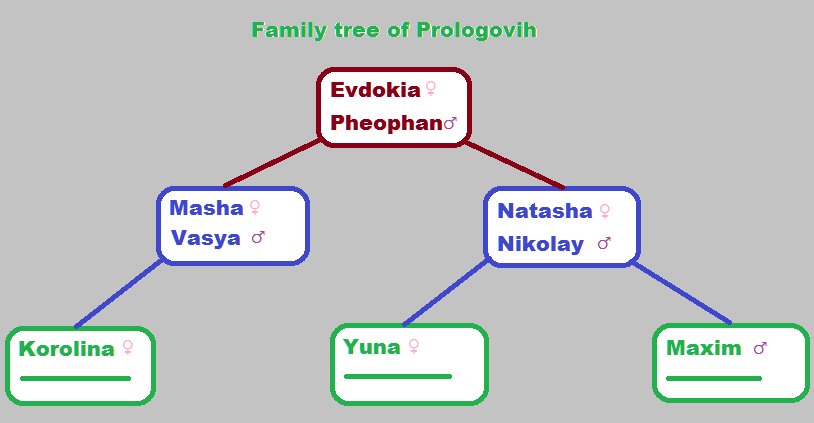

# LAB_1

1.Firstable in data source by next code were createn family with such a structure.
```
female(evdokia).
female(masha).
female(korolina).
female(natasha).
female(yuna).

male(pheophan).
male(vasya).
male(nikolay).
male(maxim).

parent(evokia,vasya).
parent(evdokia,natasha).
parent(pheophan,vasya).
parent(pheophan,natasha).
parent(masha,korolina).
parent(vasya,korolina).
parent(natasha,yuna).
parent(natasha,maxim).
parent(nikolay,yuna).
parent(nikolay,maxim).

```


Then were added code to find family roles.
To get mom and dad:
```
get_father(C) :-
    parent(X,C),
    male(X),
    format('~w is the father of ~w',[X,C]).
get_mother(C) :-
    parent(X,C),
    female(X),
    format('~w is the mother of ~w',[X,C]).

```
To get son and dauther:
```
get_son(P) :-
    parent(P,X),
    male(X),
    format('~w is the son of ~w',[X,P]).
get_dauther(P) :-
    parent(P,X),
    female(X),
    format('~w is the dauther of ~w',[X,P]).

```
Grandparents and grandchildrens:
```
get_grandfather(C) :-
    parent(Y,C),
    parent(X,Y),
    male(X),
    format('~w is the grandfather of ~w',[X,C]).
get_grandmother(C) :-
    parent(Y,C),
    parent(X,Y),
    female(X),
    format('~w is the grandmother of ~w',[X,C]).
    
get_grandson(G) :-
    parent(G,Y),
    parent(Y,X),
    male(X),
    format('~w is the grandson of ~w',[X,G]).
get_granddauther(G) :-
    parent(G,Y),
    parent(Y,X),
    female(X),
    format('~w is the granddauther of ~w',[X,G]).
```
And siblings with uncle and aunt:
```
get_brother(S) :-
    parent(P,S),
    parent(P,X),
    male(X),
    format('~w is the brother of ~w',[X,S]).
get_sister(S) :-
    parent(P,S),
    parent(P,X),
    female(X),
    format('~w is the sister of ~w',[X,S]).

get_uncle(C):-
    parent(P,C),
    parent(G,P),
    parent(G,U),
    parent(G,F),
    male(F),
    male(U),
    F\=U,
    format('~w is the uncle of ~w',[U,C]).
get_aunt(C):-
    parent(P,C),
    parent(G,P),
    parent(G,A),
    parent(M,C),
    female(M),
    female(A),
    M\=A,
    format('~w is the aunt of ~w',[A,C]).
```
Example:
```
?- get_mother(vasya).
evdokia is the mother of vasya

?- get_father(vasya).
pheophan is the father of vasya

?- get_grandfather(maxim).
pheophan is the grandfather of maxim

?- get_grandmother(yuna).
evdokia is the grandmother of yuna

?- get_granddauther(pheophan).
korolina is the granddauther of pheophan

?- get_grandson(pheophan).
maxim is the grandson of pheophan

?- get_sister(vasya).
natasha is the sister of vasya

?- get_brother(natasha).
vasya is the brother of natasha

?- get_aunt(korolina).
natasha is the aunt of korolina

?- get_uncle(maxim).
vasya is the uncle of maxim
```
2.To count sum of numbers before N with period of D were written that code:
```
sum_with_period(D,N,R):-
    N =< D,
    R = N,
    !.
sum_with_period(D,N,R):-
    N1 is N-D,
    sum_with_period(D,N1,R1),
    R is N+R1.
```
And result is so:
```
?- sum_with_period(10,100,R).
R = 550.
```
3.1 To pow number to any power were written next code:
```
pow(A,1,R):-
    R is A,
    !.
pow(A,M,R):-
    M1 is M - 1,
    pow(A,M1,R1),
    R is R1*A.

```
With example of usage:
```
?- pow(2,8,R).
R = 256.

?- pow(2,-5,R).
R = 0.03125.

?- pow(2,0.5,R).
R = 1.4142135623730951.
```
3.2 To pow number to odd power were used next block of code:
```
pow2(A,1,R):-
    R is A,
    !.
pow2(A,M,R):-
    M1 is M/2,
    pow2(A,M1,R1),
    R is R1*R1.
```
Result:
```
?- pow2(3,4,R).
R = 81.
```
4.And for the last task of counting sum of numbers to N:
```
my_sum(N, N, N).

my_sum(From, To, S) :-
  Next is From + 1,
  my_sum(Next, To, T),
  S is T + From.

```
And the result is:
```
?- my_sum(0,500,R).
R = 62750 
```
