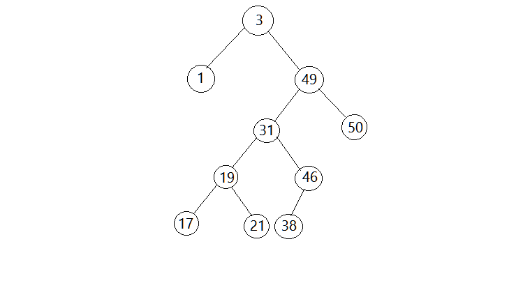

# LAB_2

1.At first task we need to create graphical representation 
of the tree we will work with.



2.Then we need to create this tree in Prolog using relations.
```
nd(3,1).
nd(3,49).
nd(49,31).
nd(49,50).
nd(31,19).
nd(31,46).
nd(19,17).
nd(19,21).
nd(46,38).
```
3.Code for deep search.
```
depth(N,S):-
    depth_search([],N,S).

depth_search( P, N, [N | P] )  :-
   goal(N).

depth_search( P, N, S)  :-
  nd(N, M),
  depth_search( [N | P], M, S).
```
And result is so:
```
?- depth(3,S).
S = [38, 46, 31, 49, 3] 
```
4.Code for breadth search.
```
breadth( S, R) :-
    breadth_search( [ [S] ], R).

breadth_search( [ [N| P] |_], [N | P] ) :-
    goal(N).

breadth_search( [ [N | P] | Ps], R) :-
    bagof([M,N|P], (nd(N,M)), P1),
    append(Ps, P1, Ps1), !,
    breadth_search( Ps1, R);
    breadth_search( Ps, R).
```
Result:
```
?- breadth(3,S).
S = [38, 46, 31, 49, 3] 
```
5.To traverse the tree in depth and breadth we need add the next code.
```
goal(0)

breadth_search( [ [N | P] | Ps], R) :-
    write(N), write(' '),
    bagof([M,N|P], (nd(N,M)), P1),
    append(Ps, P1, Ps1), !,
    breadth_search( Ps1, R);
    breadth_search( Ps, R).
 
 depth_search( P, N, S)  :-
  write(N), write(' '),
  nd(N, M),
  depth_search( [N | P], M, S).
```
Result that we get from this:
```
?- breadth(3,S).
3 1 49 31 50 19 46 17 21 38 
false.

?- depth(3,S).
3 1 49 31 19 17 21 46 38 50 
false.
```
